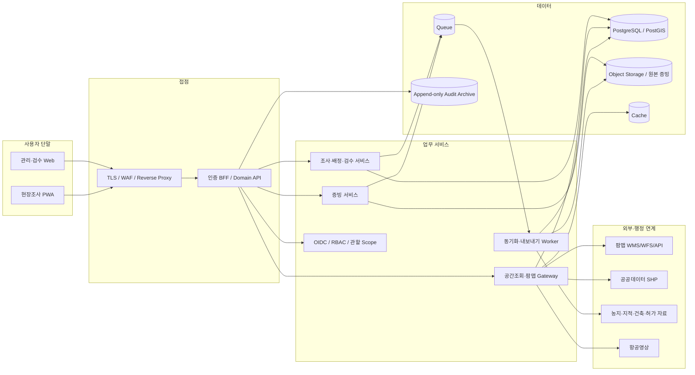
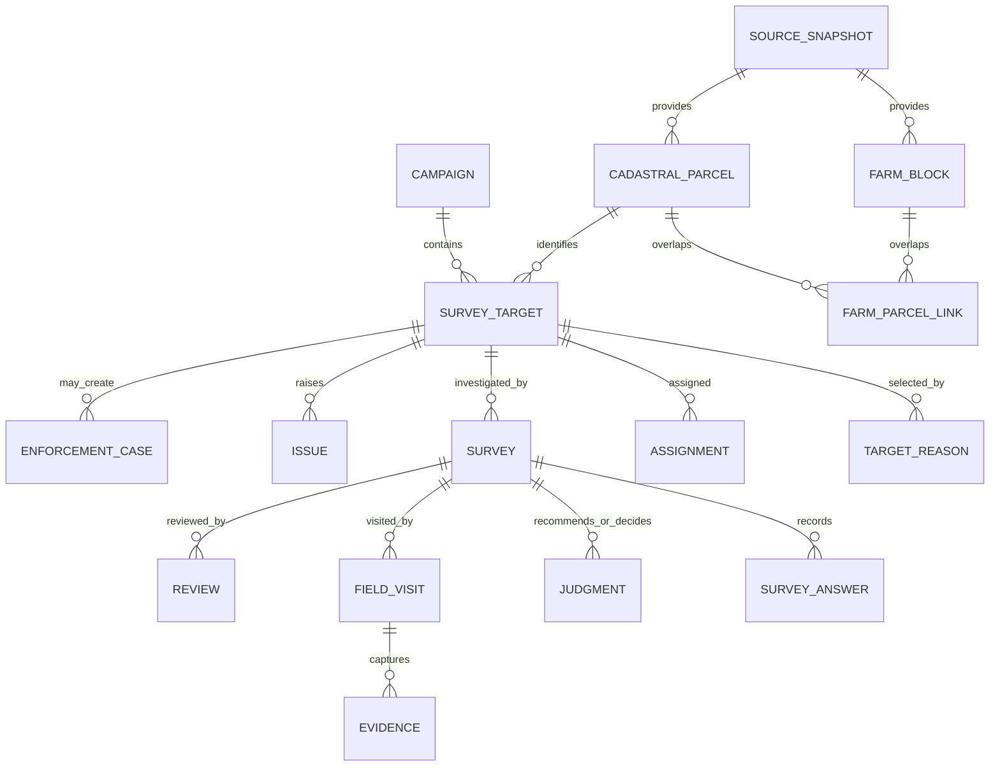

# 농지 전수조사 시스템 아키텍처

> 문서 기준일: 2026-09-01  
> 대상: 팜맵을 활용한 농지 전수조사 웹·현장 시스템의 MVP 및 운영 전환

## 1. 목적과 설계 원칙

이 시스템은 팜맵·지적·항공영상과 행정자료를 한 필지 단위로 대조하고, 기본조사부터 심층 현장조사, 검수, 결과 확정, 이슈 및 후속조치까지 추적하기 위한 업무 시스템이다.

2026년 농림축산식품부 시행지침의 조사 흐름을 기준으로 한다.

1. 기본조사: 소유관계, 실경작자, 이용현황, 휴경 여부를 행정정보와 항공사진으로 확인한다.
2. 심층조사: 기본조사에서 의심된 농지와 필수 조사군을 현장에서 조사한다.
3. 검수·결과 확정: 조사 증빙과 판단 근거를 권한자가 검수한다.
4. 후속조치: 소명, 청문, 처분 후보 등은 조사 결과와 분리된 사건으로 관리한다.

다음 원칙은 MVP부터 지켜야 한다.

- **PNU를 조사 업무의 기본 단위로 사용하되 팜맵 경계와 동일시하지 않는다.** 팜맵 농경지와 지적필지는 1:1이 아닐 수 있으므로 중첩 관계를 N:M으로 보존한다.
- **관찰 사실, 자동 추천, 조사자 의견, 최종 판정을 분리한다.** 자동화 결과만으로 법적 결론을 확정하지 않는다.
- **모든 판단은 출처·기준일·질문지·규칙 버전과 함께 재현 가능해야 한다.** 과거 캠페인의 원천자료를 최신 데이터로 덮어쓰지 않는다.
- **현장 증빙 원본은 불변으로 보존한다.** 표시용 워터마크나 위치·시각 오버레이는 파생본에만 적용한다.
- **권한은 역할뿐 아니라 관할지역, 캠페인, 배정 필지 범위까지 제한한다.**
- **팜맵 인증키와 행정연계 자격증명은 브라우저에 노출하지 않는다.**

팜맵과 자동 추천은 조사 보조자료이다. 화면과 보고서에는 자료 기준일과 함께 “최종 판정은 권한자의 확인을 거쳐 확정된다”는 안내를 표시한다.

## 2. 범위와 단계

### 2.1 현재 저장소와 MVP

현재 애플리케이션은 React, Vite, TypeScript, Leaflet 기반의 프런트엔드 프로토타입이다. MVP는 다음 한 개의 종단 흐름을 완성하는 것을 목표로 한다.

```text
캠페인 선택
→ 대상 필지 지도 검색
→ 기본조사
→ 심층조사 배정
→ 모바일 현장 사진·GPS 기록
→ 제출
→ 검수 반려·재제출
→ 결과 확정
→ 통계·내보내기
→ 감사로그 확인
```

팜맵 인증키나 행정자료 연계가 준비되지 않은 개발 환경에서는 정적 샘플/GeoJSON 어댑터를 사용한다. 화면과 도메인 코드는 데이터 공급자 인터페이스를 통해 실제 연계와 분리하며, 운영 환경에서는 동일 인터페이스 뒤에 서버 연계 어댑터를 연결한다.

### 2.2 MVP 필수 범위

- 캠페인·관할지역 선택
- PNU·주소 검색, 지도/목록 연동, 팜맵·지적·항공 레이어 전환
- 10대 심층조사 사유와 데이터 불일치 사유 표시
- 기본조사 조건부 질문지와 임시저장
- 담당자 일괄 배정 및 재배정 이력
- 현장 GPS, 사진, 메모, 오프라인 임시저장·동기화
- 제출, 검수 승인, 사유가 있는 반려, 재제출
- 이슈 등록·담당·상태·댓글
- 진행률·판정·면적 통계와 비동기 내보내기
- 역할/관할 권한, 변경 감사로그, 증빙 원본 해시

### 2.3 후속 범위

- AI 항공영상 판독 및 위험점수 고도화
- 드론 비행계획, 원본 영상, 정사영상 처리 파이프라인
- 방문 동선 최적화와 대규모 오프라인 지역팩
- 농지정보시스템·새올행정 등 기관 내부 시스템의 양방향 연계
- 전자 소명·청문·처분 및 이행강제금 업무 연계
- 데이터 웨어하우스와 장기 시계열 분석

## 3. 업무 상태 모델

단계, 진행상태, 조사결과를 하나의 열거형으로 합치지 않는다. 다음 세 축을 독립적으로 저장한다.

| 구분 | 값 | 설명 |
| --- | --- | --- |
| `stage` | `BASIC`, `DEEP`, `COMPLETE` | 기본조사, 심층조사, 조사 종료 단계 |
| `work_status` | `NOT_STARTED`, `ASSIGNED`, `IN_PROGRESS`, `SUBMITTED`, `RETURNED`, `APPROVED`, `CLOSED`, `EXCLUDED` | 현재 작업 진행상태 |
| `result` | `UNDECIDED`, `FIT`, `UNFIT`, `DEEP_REQUIRED`, `EXPLANATION_REQUIRED`, `COMPLETED_NOT_FARMLAND` | 검토 중이거나 확정된 조사결과 |

정상 전이 예시는 다음과 같다.

```text
BASIC / NOT_STARTED
→ BASIC / IN_PROGRESS
→ BASIC / SUBMITTED
→ COMPLETE / APPROVED / FIT
  또는
→ DEEP / ASSIGNED / DEEP_REQUIRED
→ DEEP / IN_PROGRESS
→ DEEP / SUBMITTED
→ DEEP / RETURNED
→ DEEP / SUBMITTED
→ COMPLETE / APPROVED / FIT | UNFIT | EXPLANATION_REQUIRED
→ COMPLETE / CLOSED
```

규칙은 다음과 같다.

- 반려에는 사유코드와 설명이 필수이다.
- 제출된 조사서는 조사자가 직접 덮어쓰지 못한다. 반려 또는 권한 있는 재개방 이후 새 revision을 만든다.
- 결과 확정 후 재개방은 관리자 또는 검수자가 사유를 입력해야 하며 감사 이벤트를 남긴다.
- `UNFIT`은 조사 결과이며 행정처분과 동일하지 않다. 소명·청문·처분은 별도 `enforcement_case`로 진행한다.
- 질문지와 추천 규칙은 캠페인에 고정된 버전을 사용한다.

## 4. 논리 아키텍처

### 4.1 MVP 구성

MVP는 프런트엔드 프로토타입을 유지하면서 연계 경계를 미리 분리한다.

- **Web UI**: React/TypeScript, React Router, Leaflet
- **UI 데이터 계층**: `SurveyRepository`, `MapLayerProvider`, `EvidenceRepository` 인터페이스
- **Demo adapter**: 정적 TypeScript/GeoJSON 데이터 및 브라우저 임시 상태
- **Real adapter**: HTTPS로 BFF/API 호출
- **지도 표시**: WMS 배경 레이어와 서버가 4326 GeoJSON으로 제공하는 조사대상 벡터
- **현장 저장**: 운영 PWA 전환 시 IndexedDB outbox; MVP에서 메모리나 Local Storage는 비민감 데모 데이터에만 사용

브라우저 코드에 실제 팜맵 인증키, 개인정보, 운영용 행정자료를 포함해서는 안 된다.

### 4.2 운영 구성



소규모 파일럿은 모듈러 모놀리스 API와 단일 Worker로 시작할 수 있다. 서비스 경계는 코드 모듈과 데이터 소유권으로 먼저 분리하고, 사용량이 확인되기 전에는 불필요하게 마이크로서비스로 쪼개지 않는다.

### 4.3 구성요소 책임

| 구성요소 | 주요 책임 |
| --- | --- |
| Web/PWA | 지도·목록, 조사 폼, 오프라인 outbox, 증빙 캡처, 검수 UI |
| BFF/Domain API | 인증 컨텍스트, 관할 권한, 업무 전이, 낙관적 잠금, 응답 마스킹 |
| Survey module | 캠페인, 대상, 배정, 조사 revision, 판정, 검수, 이슈 |
| Geo/FarmMap gateway | 팜맵 인증키 은닉, WMS 프록시, WFS/API 정규화, bbox 조회, CRS 변환 |
| Evidence module | 사전서명 업로드, MIME/크기 검사, 서버 해시, 원본 잠금, 썸네일 |
| Worker | 원천자료 가져오기, 공간 정합성 검사, 중첩 계산, export, 바이러스 검사 |
| PostgreSQL/PostGIS | 업무 트랜잭션, 공간 인덱스, source snapshot, 감사 이벤트 인덱스 |
| Object storage | 사진·문서 원본, 파생본, 원천파일, 결과 export |
| Cache | GetCapabilities, 공개 지도 타일/메타데이터, 짧은 수명의 조회 캐시 |

## 5. 핵심 데이터 모델

### 5.1 관계 개요



### 5.2 주요 테이블

| 테이블 | 핵심 필드와 제약 |
| --- | --- |
| `organizations` | `id`, `parent_id`, `type`, `name` |
| `admin_areas` | 법정동코드, 명칭, 레벨, `geom_5179`; 코드 이력 보존 |
| `users`, `roles`, `user_scopes` | 사용자 상태, 기관, 역할, 캠페인, 관할 행정구역 scope |
| `campaigns` | 조사연도, 기본/심층 기간, 상태, `questionnaire_version`, `rule_version` |
| `source_snapshots` | 공급자, 자료연도/기준일, 수신일, 원본 체크섬, CRS, 스키마 버전, 활성 상태 |
| `farm_blocks` | `snapshot_id`, `farmmap_id`, 분류코드, 면적, 대표주소, `geom_5179 geometry(MultiPolygon,5179)` |
| `cadastral_parcels` | `snapshot_id`, PNU, 지목, 지적면적, 법정주소, `geom_5179 geometry(MultiPolygon,5179)` |
| `farm_parcel_links` | 팜맵·지적 FK, 중첩면적, 팜맵 대비율, 지적 대비율, 대표 여부, 신뢰도 |
| `parcel_lineage` | 구 snapshot/필지와 신 snapshot/필지의 분할·합병·변경 관계 |
| `ownership_interests` | parcel, 암호화된 `subject_ref`, 소유자 유형, 지분, 취득일/원인; PII 분리 |
| `survey_targets` | campaign, parcel, 단계, 진행상태, 결과, 위험점수, 기한, `row_version` |
| `target_reasons` | 심층조사 10대군 또는 데이터 품질 사유코드, 근거 출처 |
| `assignments` | 대상, 담당자, 배정자, 기한, 배정/재배정 사유, 유효기간 |
| `surveys` | 대상, `BASIC`/`DEEP`, template version, revision, 작성·제출자/시각 |
| `survey_answers` | question code, typed JSON value, 출처, 신뢰도, 조사자 메모 |
| `judgments` | 차원, 결과, 근거코드, 설명, 규칙 버전, 추천/확정 구분, 확정자 |
| `field_visits` | 로컬 UUID, 기기, 시작/종료, check-in 좌표, 정확도, 경계거리, 동기화 상태 |
| `evidence` | 범주, object key, SHA-256, 캡처/수신시각, GPS·정확도·방향, MIME, 원본 출처 |
| `reviews` | 조사 revision, 승인/반려, 사유, 검수자, 시각 |
| `issues`, `issue_comments` | 유형, 심각도, 상태, 담당자, SLA/기한, 댓글·첨부 |
| `enforcement_cases` | 조사결과와 분리된 소명·청문·처분 상태와 기한 |
| `export_jobs` | 필터 snapshot, 포맷, 요청자, 목적, 상태, 만료시각, 결과 object key |
| `audit_events` | actor/scope, action, entity/version, 마스킹된 변경 전후, 사유, request/device/IP, 서버시각 |

### 5.3 데이터 제약과 인덱스

- PNU는 시간에 따라 분할·합병될 수 있으므로 전역 unique로 간주하지 않는다. `source_snapshot_id + pnu`에 unique 제약을 둔다.
- `farmmap_id`도 `source_snapshot_id + farmmap_id`로 식별한다.
- 캠페인은 사용한 `source_snapshot_id`를 고정한다. 새 팜맵 연도 수신 시 새 snapshot을 만들고 기존 캠페인을 변경하지 않는다.
- `farm_blocks.geom_5179`, `cadastral_parcels.geom_5179`, `admin_areas.geom_5179`에 GiST 공간 인덱스를 둔다.
- 목록 조회에는 `(campaign_id, work_status, stage)`, `(campaign_id, assignee_id, due_at)`, `(campaign_id, result)` 복합 인덱스를 둔다.
- 중첩률은 `overlap_area / farm_area`, `overlap_area / cadastral_area`를 각각 보존한다. 대표 PNU 하나만 저장해 다른 중첩관계를 잃지 않는다.
- 조사·판정·검수는 revision FK를 사용한다. 최신 행을 수정하는 대신 revision을 추가하고 현재 revision 포인터만 갱신한다.
- 삭제가 필요한 업무 데이터는 hard delete 대신 상태 전이와 보존정책을 사용한다. 법적 삭제 요청 대상 PII는 별도 저장영역과 삭제 절차를 둔다.

권장 데이터 품질 코드는 다음과 같다.

- `PNU_MISMATCH`
- `NO_FARM_PARCEL_LINK`
- `MULTIPLE_FARM_PARCEL_LINKS`
- `INVALID_GEOMETRY`
- `AREA_DIFFERENCE`
- `DUPLICATE_SOURCE_ID`
- `OUTDATED_SOURCE`
- `MISSING_REQUIRED_ATTRIBUTE`

2026년 지침 기준 심층조사 대상 사유는 다중값으로 저장하며, 표시문구와 코드값을 분리한다.

| 코드 | 표시명 |
| --- | --- |
| `LAND_TRANSACTION_PERMIT_ZONE` | 토지거래허가구역 농지 |
| `CAPITAL_REGION` | 수도권 농지 |
| `AUCTION_ACQUISITION` | 경매 취득 농지 |
| `AGRICULTURAL_CORPORATION` | 농업법인 소유 농지 |
| `FOREIGN_OWNER` | 외국인·외국국적동포 소유 농지 |
| `RECENT_CERTIFICATE_10Y` | 최근 10년 내 농지취득자격증명 발급 농지 |
| `NONRESIDENT_OWNER_10Y` | 최근 10년 내 관외거주자 소유 농지 |
| `SHARED_ACQUISITION_10Y` | 최근 10년 내 공유취득자 소유 농지 |
| `PRIOR_FINDING_10Y` | 최근 10년 내 이용실태조사 적발 농지 |
| `BASIC_SURVEY_SUSPECTED` | 기본조사 결과 불법 의심 농지 등 |

코드 목록은 캠페인의 지침 버전에 귀속한다. 향후 지침이 바뀌어도 과거 코드와 표시문구를 덮어쓰지 않는다. PNU는 숫자가 아니라 고정 형식의 문자열로 취급해 선행 0, 엑셀 지수표기, 자릿수 손실을 방지한다.

## 6. 팜맵 및 공간정보 연계

### 6.1 연계 수단별 용도

| 수단 | 권장 용도 | 주의사항 |
| --- | --- | --- |
| WMS | 팜맵·항공 등 배경 시각화 | 픽셀 이미지이므로 조사대상 식별과 속성의 원천으로 사용하지 않음 |
| WFS | 현재 지도영역의 벡터 조회, 공간 선택, 속성 확인 | 대량 전국 동기화보다는 bbox/필터 조회에 사용; 응답 크기 제한 |
| SHP | 연도별/지역별 기준자료 일괄 적재와 재현 가능한 snapshot | 문자 인코딩, `.prj`, geometry validity, 필드명 절단 확인 |
| 데이터 API | PNU·팜맵 ID 상세조회, 속성 보강, 변경 확인 | 인증키·도메인·응답 스키마·장애 대응 필요 |

초기 운영은 **SHP 기준 snapshot + WMS 시각화 + API/WFS 증분·상세조회** 조합을 권장한다. 외부 서비스 응답만으로 과거 조사 결과를 재구성하지 않고, 조사에 사용한 정규화 snapshot을 내부에 보존한다.

### 6.2 인증과 네트워크

- 팜맵 Open API 인증키는 운영 도메인으로 발급받고 Secret Manager 또는 동등한 비밀 저장소에 보관한다.
- 브라우저가 팜맵 API를 직접 호출하지 않는다. Geo/FarmMap gateway가 인증, 재시도, 스키마 정규화, 응답 필터링을 수행한다.
- 키가 query string에 포함되는 연계는 reverse proxy와 애플리케이션 access log에서 query를 마스킹한다.
- WMS/WFS endpoint, 버전, layer name, 지원 CRS는 배포 시 `GetCapabilities`로 확인하고 설정값으로 관리한다. 문서에 나온 값을 코드에 고정하지 않는다.
- 운영 전 공식 이용조건, 호출정책, 캐시·재배포 허용범위, 장애 연락처를 기관 담당자와 확인한다.
- 외부 장애 시 마지막 성공 snapshot은 조회 가능하게 유지하되 `연계 지연`과 `자료 기준일`을 사용자에게 표시한다.

### 6.3 EPSG:5179와 지도 표출

팜맵 공식 안내상 원천 공간정보 좌표계는 UTM-K(GRS80), **EPSG:5179**이다.

- 원본 geometry와 면적·거리 계산은 PostGIS의 `geometry(..., 5179)`에서 수행한다.
- Leaflet의 일반 웹지도는 EPSG:3857/4326 흐름을 사용하므로, 조사대상 벡터는 서버에서 `ST_Transform(geom_5179, 4326)`한 GeoJSON으로 전달한다.
- 대용량 벡터는 zoom별 단순화 또는 vector tile을 사용하되 원본 geometry는 판정·면적 계산에 사용한다.
- WMS는 서버가 지원하는 CRS로 요청한다. 5179 WMS를 3857 basemap과 함께 사용할 때는 지도 서버의 재투영 지원을 검증하거나 내부 타일 프록시에서 재투영한다.
- WMS 1.3.0의 EPSG:4326 axis order와 WMS 1.1.1의 좌표 순서 차이를 자동 테스트한다.
- 위·경도 GPS는 WGS84(EPSG:4326)로 수신하고, 필지 경계거리 계산 전에 5179로 변환한다.
- 좌표 변환 라이브러리와 EPSG 정의 버전을 고정하고, 알려진 기준점과 샘플 필지를 이용해 위치·면적 허용오차를 검증한다.

### 6.4 적재 파이프라인

1. 원본 WFS/API/SHP 파일과 응답 메타데이터를 raw object storage에 저장한다.
2. 파일 체크섬, 자료연도, CRS, 문자 인코딩, 필수 속성을 검증한다.
3. GDAL/ogr2ogr 또는 동등한 도구로 5179에 정규화한다.
4. 빈 geometry, self-intersection, polygon 방향, MultiPolygon 형식을 검사하고 원본을 보존한 채 정규화본을 만든다.
5. staging schema에 적재하고 중복 ID, 행정구역 범위, 면적 이상치를 검사한다.
6. 팜맵과 지적필지를 공간교차해 N:M `farm_parcel_links`와 중첩률을 계산한다.
7. 이전 snapshot과 분할·합병·형상·분류 변화를 계산해 lineage를 만든다.
8. 표본 육안검수와 건수/면적 reconciliation을 통과한 snapshot만 원자적으로 활성화한다.
9. 실패한 적재는 기존 활성 snapshot에 영향을 주지 않고 재실행 가능해야 한다.

### 6.5 조회 성능과 캐시

- 지도 목록 API는 bbox, zoom, 캠페인, 상태 필터를 필수로 받고 cursor pagination을 사용한다.
- 낮은 zoom에서는 개별 필지 대신 집계/클러스터를 제공한다.
- 공개 지도 타일과 capabilities는 라이선스가 허용하는 범위에서 캐시한다. 개인정보가 포함된 응답은 공유 캐시에 넣지 않는다.
- WMS/API 응답 캐시 키에는 공급자, layer, 버전, CRS, bbox, 자료연도를 포함한다.
- 외부 API 재시도는 짧은 timeout, 지수 backoff, circuit breaker로 제한하며 무제한 재시도하지 않는다.

## 7. 업무 API와 동기화 규칙

권장 API 경계는 다음과 같다.

- `GET /campaigns`
- `GET /targets?campaignId=&bbox=&status=&cursor=`
- `GET /targets/{id}`
- `POST /assignments:bulk`
- `POST /surveys`
- `PATCH /surveys/{id}`: `If-Match` 또는 `rowVersion` 필수
- `POST /surveys/{id}:submit`: idempotency key 필수
- `POST /reviews`: 승인/반려 사유와 대상 revision 필수
- `POST /evidence/uploads`: 사전서명 업로드 세션 발급
- `POST /evidence/uploads/{id}:complete`: 서버 해시·메타데이터 확정
- `POST /issues`, `PATCH /issues/{id}`
- `POST /exports`: 비동기 작업 생성
- `GET /audit-events`: 권한 있는 사용자만 조회

서버는 상태 전이와 권한을 최종 검증한다. UI에서 버튼을 숨기는 것만으로 권한을 구현하지 않는다.

### 7.1 현장 오프라인 동기화

- 지역팩에는 배정된 필지, 단순화 geometry, 질문지 버전, 필요한 항공 썸네일만 포함한다.
- 단말 변경은 IndexedDB outbox에 로컬 UUID, base revision, 생성시각과 함께 저장한다.
- 제출·증빙 확정 요청은 idempotency key로 재전송할 수 있어야 한다.
- 텍스트 답변을 먼저 동기화하고 대용량 증빙은 재개 가능한 업로드로 전송한다.
- 증빙 업로드 완료와 서버 해시 확정 전에는 조사서 최종 제출을 허용하지 않는다.
- 서버 revision과 base revision이 다르면 자동 덮어쓰기하지 않고 충돌 화면을 제공한다.
- 이미 제출된 revision에 대한 오프라인 변경은 새 revision 또는 반려 후 수정으로 처리한다.
- 위치 권한 거부, GPS 정확도 미달, 필지 밖 조사에는 차단 대신 운영정책에 따른 예외사유와 추가 증빙을 요구한다.
- 지속적 위치추적은 MVP 범위에서 제외하고 check-in 및 사진 캡처 지점만 최소 수집한다.

## 8. 권한과 개인정보 보호

### 8.1 역할

| 역할 | 허용 범위 |
| --- | --- |
| 시스템관리자 | 사용자, 코드, 연계, 질문지 설정. 조사 확정 권한은 별도 부여 |
| 본청/총괄 | 캠페인, 광역 진행현황, 정책 통계, 승인된 대량 export |
| 시군구 관리자 | 관할 대상 생성·배정, 검수, 결과 확정, 이슈 관리 |
| 조사자 | 자신에게 배정된 필지 조회·작성·제출, 반려 건 재작성 |
| 검수자 | 제출 revision 검토, 승인·반려·확정. 원본 증빙 수정 불가 |
| 감사/열람 | 관할 범위 read-only, 감사로그와 보고서 조회 |

권한은 `role × organization × campaign × admin_area × assignment` 교집합으로 계산한다. 기본 정책은 deny이며 다음을 적용한다.

- 조사자는 배정되지 않은 필지의 소유자·연락처를 조회하지 못한다.
- 목록 화면에서는 소유자명 등 민감정보를 기본 마스킹한다.
- 가능하면 조사자와 최종 검수자를 분리한다. 자기 제출 승인에는 별도 권한과 사유를 요구한다.
- 시스템관리자 권한만으로 조사결과를 변경할 수 없게 한다.
- 대량조회·내보내기는 별도 scope와 목적 입력, 승인 또는 사후점검 정책을 둔다.
- 세션, export URL, 증빙 URL은 짧은 만료시간을 사용한다.

### 8.2 개인정보와 비밀정보

- 개인정보는 업무에 필요한 최소 항목만 수집하고 민감한 주체 정보는 별도 테이블/암호화 키로 분리한다.
- 전송구간 TLS, 데이터베이스·object storage 저장 암호화, 비밀정보 정기 회전을 적용한다.
- API 응답 DTO에서 역할별 필드 마스킹을 적용하며 원본 엔티티를 그대로 직렬화하지 않는다.
- 일반 애플리케이션 로그에 소유자명, 연락처, 정확한 GPS, API key, 증빙 URL을 기록하지 않는다.
- 운영·개발·테스트 데이터를 분리하고 운영 개인정보를 개발 환경에 복사하지 않는다.
- 보존기간과 파기 기준은 기관의 기록물·개인정보 정책 및 법률 검토 후 캠페인별 정책으로 확정한다.

## 9. 감사 추적과 증빙 보존

### 9.1 감사 이벤트

최소한 다음 이벤트를 append-only로 기록한다.

- 로그인 성공/실패, 권한·관할 변경
- 대상 생성/제외, 일괄 배정/재배정
- 조사서 생성, 임시저장, 제출, 반려, 재제출, 재개방
- 자동추천 생성과 사용된 규칙 버전
- 판정 확정·변경과 필수 사유
- 증빙 등록·조회·다운로드·삭제 요청
- 이슈 상태·담당·기한 변경
- 개인정보 조회와 대량 export 생성·다운로드
- 원천 snapshot 활성화·비활성화

감사 이벤트에는 actor, 당시 역할/scope, action, entity와 revision, 마스킹된 변경 전후, 사유, request ID, device/session, IP, 서버시각을 포함한다. 애플리케이션 관리자가 원본 이벤트를 수정하지 못하도록 별도 권한과 보관소를 사용하고, 정기적으로 변경 불가 archive 또는 해시 체인으로 무결성을 검증한다.

### 9.2 증빙 체인

1. 클라이언트는 캡처시각, WGS84 GPS, 정확도, 방향, 기기 식별자, 촬영 출처를 전송한다.
2. 서버는 수신시각을 별도로 기록하고 MIME, 크기, 확장자, 악성코드를 검사한다.
3. 서버가 원본 바이트의 SHA-256을 계산한다. 클라이언트 해시는 보조값으로만 사용한다.
4. 원본은 versioning/Object Lock 등 불변 정책이 적용된 저장영역에 기록한다.
5. 썸네일, EXIF 제거 공개본, 워터마크본은 원본과 다른 object key 및 해시로 생성한다.
6. 데이터베이스에는 원본과 파생본의 관계, 처리 버전, 접근 이력을 기록한다.
7. 삭제 또는 법적 보존 요청은 즉시 물리삭제하지 않고 승인 워크플로와 legal hold를 확인한다.

서버 수신시각과 사진 EXIF 시각이 다르거나 EXIF가 없다는 이유만으로 증빙을 자동 폐기하지 않는다. 차이를 품질 플래그로 표시하고 검수자가 판단한다.

## 10. 내보내기와 보고

- 필지수와 면적을 함께 제공하고 어느 geometry/면적 필드를 집계했는지 표시한다.
- 법적 조사 단위 집계는 지적 PNU 기준으로 하며 N:M 팜맵 링크 때문에 중복 합산되지 않게 한다.
- export에는 캠페인, 필터 snapshot, 자료연도, 생성시각, 생성자, 질문지/규칙 버전을 포함한다.
- XLSX/CSV는 한글 인코딩과 긴 PNU의 문자열 보존을 검증한다.
- GeoJSON은 기본 EPSG:4326, SHP/GeoPackage는 CRS 메타데이터를 포함하고 요청 시 5179를 제공한다.
- 개인정보 포함 export는 목적 입력, 별도 권한, 파일 암호화 또는 통제된 다운로드, 만료, 워터마크, 감사 이벤트를 적용한다.
- 대용량 export는 비동기 job으로 실행하며 다운로드 URL을 직접 object storage 공개 URL로 만들지 않는다.

## 11. 배포와 운영

### 11.1 환경 분리

- `local`: 샘플 데이터와 mock provider, 실제 개인정보·운영 키 없음
- `staging`: 운영과 동일한 네트워크/CRS/스토리지 구성, 비식별 또는 합성 데이터
- `production`: 기관 인증, 운영 팜맵 키, 암호화, 감사 archive, 백업

환경별 설정은 코드가 아니라 환경변수와 Secret Manager로 관리한다. 프런트엔드 빌드 시 포함되는 `VITE_*` 값에는 비밀을 넣지 않는다.

### 11.2 배포 형태

- 정적 Web은 CDN 또는 reverse proxy 뒤에서 제공한다.
- API와 Worker는 container image로 동일 artifact를 환경별 설정만 바꿔 배포한다.
- PostgreSQL/PostGIS와 object storage는 가능하면 관리형 또는 기관 표준 HA 서비스를 사용한다.
- DB schema migration은 versioned migration으로 선행/후행 호환성을 검증하고 롤백 또는 roll-forward 절차를 준비한다.
- Geo/FarmMap gateway는 수평확장이 가능한 stateless 구성으로 두고 cache/queue는 외부화한다.
- 운영 데이터와 증빙은 정기 백업하며 복원 훈련으로 실제 복구 가능성을 확인한다.

RPO/RTO, 보존기간, 동시사용자, 전국 단위 목표 처리량은 발주·운영기관의 등급에 따라 확정한다. 수치가 확정되기 전에도 다음 지표는 수집한다.

- API 성공률, p50/p95/p99 지연시간, 4xx/5xx
- bbox 조회 필지수와 공간쿼리 지연
- 팜맵 WMS/WFS/API 가용성·지연·마지막 성공시각
- 원천 snapshot 적재 지연과 데이터 품질 오류 수
- 오프라인 outbox 적체·충돌·재시도 수
- 증빙 업로드 실패율, 악성파일/해시 불일치
- 검수 대기·반려·기한초과 수
- export 건수·용량·실패율과 비정상 대량조회

외부 지도 장애와 내부 업무 API 장애를 분리해 경보하고, 연계 장애 중에도 이미 내려받은 현장조사와 마지막 활성 snapshot 조회는 가능한 범위에서 유지한다.

## 12. 배포 전 체크리스트

### 12.1 공식자료·계약·연계

- [ ] 적용할 농지 전수조사 지침의 연도와 개정본을 업무부서가 승인했다.
- [ ] 질문지와 추천 규칙이 승인된 지침 버전에 고정되어 있다.
- [ ] 팜맵 Open API 인증키가 운영 도메인으로 발급되었다.
- [ ] WMS/WFS/API의 현재 endpoint, 버전, layer, 지원 CRS를 `GetCapabilities`와 명세서로 확인했다.
- [ ] 호출정책, 캐시, 내부 저장, 재배포, 장애 대응 연락처를 확인했다.
- [ ] 지적·소유·농지대장·허가 등 행정자료의 제공 근거와 접근권한을 확인했다.
- [ ] 화면과 보고서에 자료 기준일, 출처, 참고자료 고지가 표시된다.

### 12.2 데이터·공간정합성

- [ ] 원본 파일/응답 체크섬과 snapshot 메타데이터가 보존된다.
- [ ] SHP 문자 인코딩, `.prj`, 필드명, MultiPolygon 변환을 검증했다.
- [ ] EPSG:5179↔4326↔3857 변환을 기준점과 실제 필지로 검증했다.
- [ ] WMS 1.1.1/1.3.0 axis order 테스트가 있다.
- [ ] 면적·거리 계산이 5179 geometry에서 수행된다.
- [ ] 팜맵↔지적 N:M 링크와 양방향 중첩률을 표본 검수했다.
- [ ] PNU 불일치, 다중중첩, 미매칭, 면적차이를 UI에서 확인할 수 있다.
- [ ] 이전 snapshot의 조사기록이 최신 snapshot 활성화 후에도 재현된다.
- [ ] 분할·합병 필지 lineage와 중복 집계 방지를 검증했다.

### 12.3 업무 기능

- [ ] 기본→심층→제출→반려→재제출→확정→마감 상태 전이 테스트가 있다.
- [ ] 제출/승인/재개방 권한과 사유 필수 규칙을 서버에서 검증한다.
- [ ] 조건부 필수문항과 증빙 누락 검사가 질문지 버전별로 동작한다.
- [ ] 동일 필지 동시수정이 `rowVersion`/ETag로 탐지된다.
- [ ] 자동추천 근거, 입력자료, 규칙 버전이 재현된다.
- [ ] 조사결과와 행정처분 사건 상태가 분리되어 있다.
- [ ] 필지수·면적 통계와 원자료를 표본 대조했다.

### 12.4 현장·오프라인

- [ ] 저속/단절/재연결, 앱 종료, 중복 탭, 업로드 재시도를 시험했다.
- [ ] 지역팩은 배정된 필지와 필요한 최소자료만 포함한다.
- [ ] GPS 거부·정확도 미달·필지 외부·접근불가 예외 흐름이 있다.
- [ ] 로컬 UUID와 idempotency key로 중복 방문·제출을 막는다.
- [ ] 충돌 시 자동 덮어쓰지 않고 사용자가 확인할 수 있다.
- [ ] 모든 증빙 업로드 확정 전 최종 제출이 차단된다.
- [ ] 지원 대상 Android/iOS 브라우저에서 카메라, GPS, 대용량 업로드를 검증했다.

### 12.5 보안·개인정보·감사

- [ ] 브라우저 bundle, source map, network 요청에 API key가 없다.
- [ ] 역할×기관×캠페인×관할×배정의 deny-by-default 권한 테스트가 있다.
- [ ] 조사자가 미배정 필지의 개인정보를 조회할 수 없다.
- [ ] 소유자·연락처·GPS·증빙 URL이 일반 로그에서 마스킹된다.
- [ ] 대량조회/export에 별도 권한, 목적, 만료, 감사 이벤트가 적용된다.
- [ ] 관리자도 감사 이벤트와 증빙 원본을 임의 변경할 수 없다.
- [ ] 파일 MIME/크기/악성코드 검사와 서버 SHA-256 계산이 동작한다.
- [ ] 원본과 파생본이 분리되고 원본 object versioning/lock을 확인했다.
- [ ] 개인정보 보존·파기·legal hold 절차를 업무/법무/보안 담당자가 승인했다.
- [ ] 침투테스트 또는 기관 보안점검의 주요 취약점이 조치되었다.

### 12.6 성능·복구·운영

- [ ] 목표 필지수와 동시사용자 기준 지도 bbox, 목록, 제출, export 부하테스트를 통과했다.
- [ ] 낮은 zoom에서 개별 전국 필지를 브라우저에 전송하지 않는다.
- [ ] 팜맵/행정연계 timeout, retry, circuit breaker와 사용자 안내를 시험했다.
- [ ] DB·object storage 백업과 복원 훈련을 완료했다.
- [ ] migration 실패, 애플리케이션 rollback/roll-forward 절차가 있다.
- [ ] 외부 연계, API, Worker, 저장소, 오프라인 동기화 대시보드와 경보가 있다.
- [ ] 담당자, 장애등급, 연락망, 수동 우회, 사후보고를 포함한 runbook이 있다.
- [ ] 운영자·조사자·검수자 교육과 인수 테스트를 완료했다.

## 13. 공식 참고자료

- [농림축산식품부, 2026 농지 전수조사 시행지침 PDF](https://mafra.go.kr/bbs/home/795/597611/download.do)
- [농림축산식품부, 2026 농지 전수조사 추진계획](https://www.mafra.go.kr/bbs/home/796/578099/artclView.do)
- [농식품 팜맵 서비스](https://agis.epis.or.kr/ASD/main/intro.do)
- [농식품 팜맵 FAQ: WMS/WFS, API, 좌표계, PNU 정합성 안내](https://agis.epis.or.kr/ASD/guide/faq.do?bbsSn=2)
- [농식품 팜맵 서비스 이용안내 및 Open API 안내](https://agis.epis.or.kr/ASD/guide/faq.do?bbsSn=3)
- [농지공간포털 이용실태조사 안내](https://njy.mafra.go.kr/nnjy/main/info/nnjyInfo04.do)

공식 서비스의 API 명세, 제공 레이어, 호출조건과 지침은 변경될 수 있다. 구현 또는 배포 시 링크의 최신 문서와 발급받은 명세서를 다시 확인하고, 확인일·명세 버전을 `source_snapshots`와 운영 설정 이력에 기록한다.
